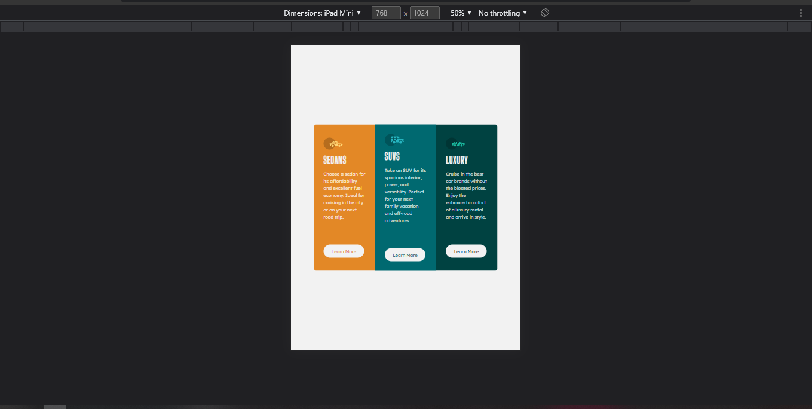
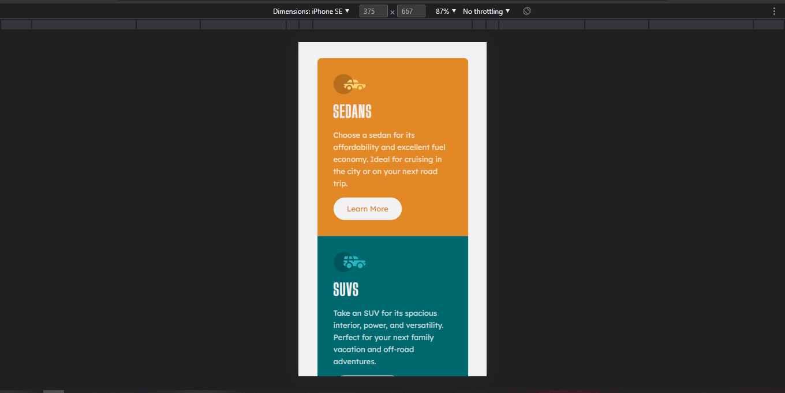

# Frontend Mentor - 3-column preview card component solution

This is a solution to the [3-column preview card component challenge on Frontend Mentor](https://www.frontendmentor.io/challenges/3column-preview-card-component-pH92eAR2-). Frontend Mentor challenges help you improve your coding skills by building realistic projects.

## Table of contents

-   [Overview](#overview)
    -   [The challenge](#the-challenge)
    -   [Screenshot](#screenshot)
    -   [Links](#links)
-   [My process](#my-process)
    -   [Built with](#built-with)
    -   [Continued development](#continued-development)
    -   [Useful resources](#useful-resources)
-   [Author](#author)

## Overview

### The challenge

Users should be able to:

-   View the optimal layout depending on their device's screen size
-   See hover states for interactive elements

### Screenshot

-   desktop
    

-   tablet
    
    

-   mobile
    
    
    

### Links

-   Solution URL: [Add solution URL here](https://your-solution-url.com)
-   Live Site URL: (https://suchaguylikeme-3columnpreviewcard.pages.dev)

## My process

### Built with

-   Semantic HTML5 markup
-   CSS custom properties
-   Flexbox
-   CSS Grid
-   Mobile-first workflow

### Continued development

The use of flexbox, grid, sementic markup and best practices.

### Useful resources

-   (https://www.w3schools.com) - This helped with learning both html and css, but there's various other sites that you could learn it too.

-   (https://www.freecodecamp.org) - This helped searching for specific solutions to my problem at hand. Used freecodecamp in conjunction with w3schools.

## Author

-   Frontend Mentor - [@suchAGuyLikeMe](https://www.frontendmentor.io/profile/suchAGuyLikeMe)
